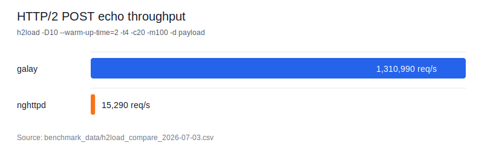
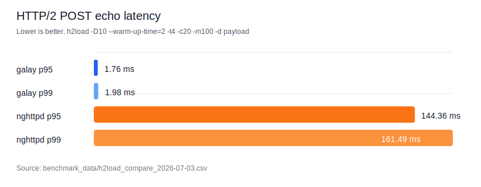

# HTTP/2 性能测试

本文记录 HTTP/2 kernel 层压力基准。当前结果覆盖 `h2_core` 出站入口、`frame_disp`、`flow_control`、`out_sched`，不包含网络 I/O、TLS、HPACK 编解码和应用层回调。

## 测试入口

```bash
rtk cmake --build build --target benchmark_http2_h2_kernel_pressure
rtk ./build/benchmark/http2/benchmark_http2_h2_kernel_pressure <streams> <payload_bytes> <flow_rounds>
```

源码：

- `benchmark/http2/b14_h2_kernel_pressure.cc`
- `test/http2/t85_h2pressure.cc`

## 测试环境

- 日期：2026-06-20
- 系统：macOS 26.3.1，arm64
- CPU：Apple M4 Pro，12 cores
- 编译器：Apple clang 17.0.0
- 构建类型：`CMAKE_BUILD_TYPE` 为空，使用当前 `build` 目录默认配置

## 压测结果

| streams | payload/stream | flow rounds | elapsed ms | workload hot stage | throughput bottleneck | scheduler frame QPS | bytes scheduler frame QPS | scheduler uplift | core frame QPS | core bytes QPS | core uplift | flow ops/s | dispatch frame QPS |
|---:|---:|---:|---:|---|---|---:|---:|---:|---:|---:|---:|---:|---:|
| 1,000 | 128 B | 20,000 | 20.2114 | flow_control | scheduler | 1,789,340 | 2,870,510 | +60.4% | 2,024,250 | 2,735,240 | +35.1% | 14,950,600 | 2,758,260 |
| 10,000 | 128 B | 200,000 | 183.124 | flow_control | scheduler | 2,079,530 | 2,982,180 | +43.4% | 2,210,550 | 2,836,530 | +28.3% | 17,026,500 | 3,101,870 |
| 10,000 | 1,024 B | 200,000 | 949.486 | scheduler | scheduler | 2,458,390 | 3,570,930 | +45.3% | 2,525,710 | 3,181,830 | +26.0% | 16,421,400 | 2,996,070 |

原始命令：

```bash
rtk ./build/benchmark/http2/benchmark_http2_h2_kernel_pressure 1000 128 20000
rtk ./build/benchmark/http2/benchmark_http2_h2_kernel_pressure 10000 128 200000
rtk ./build/benchmark/http2/benchmark_http2_h2_kernel_pressure 10000 1024 200000
```

## 瓶颈结论

当前真实吞吐瓶颈在 DATA frame 产出路径。`out_sched` 底层调度和 `h2_core` 生产出站入口都显示 bytes 路径明显快于 frame 对象路径。

证据：

- 三组负载的 `throughput_bottleneck_stage` 均为 `scheduler`。
- 大 body 场景下 scheduler 同时成为总耗时热点：`scheduler_ms=260.333`，明显高于 `flow_ms=48.7169` 和 `dispatch_ms=6.67575`。
- `h2_core` 生产出站入口大 body 场景中，frame 对象路径约 `2.53M frames/s`，bytes 路径约 `3.18M frames/s`，提升约 `26.0%`。
- 底层 scheduler bytes 路径约 `2.87M-3.57M frames/s`，稳定高于 frame 对象路径的约 `1.79M-2.46M frames/s`。

主要原因是每个 DATA frame 都会构造 `Http2DataFrame` 对象、生成 payload `std::string`，并通过 `std::unique_ptr` 放入 selection。大 body 被切成大量小 frame 后，这条路径的对象分配和 payload 拷贝成为主成本。

## 已实施优化

### Task 13: selection 预分配

`out_sched` 已对 selection 做 O(1) reserve hint：按 `conn_window / max_frame_size` 预留 DATA frame 容量，并在队列路径额外纳入 control/header frame 数。

验证结论：

- 精确逐 stream 估算会额外扫描 pending 数据，反而拖慢热路径，已改为 O(1) 上界估算。
- 该优化保持 API 和调度行为不变，主要减少 vector 扩容抖动；单独收益受负载波动影响，不再作为主要优化收益来源。

### Task 15: DATA bytes 调度路径

新增 `Http2OutboundScheduler::pickSendableBytes()`，直接产出已序列化 DATA frame bytes，绕过 `Http2DataFrame` 对象和 `std::unique_ptr<Http2Frame>` 分配。

大 body 样本：

```text
streams=10000 payload_bytes=1024 flow_rounds=200000
scheduler_ms=260.333 scheduler_frame_qps=2.45839e+06 scheduler_mib_per_s=37.512
bytes_scheduler_ms=179.225 bytes_scheduler_frame_qps=3.57093e+06 bytes_scheduler_mib_per_s=54.4881
```

优化效果：

- DATA frame 产出吞吐从约 `2.46M frames/s` 提升到约 `3.57M frames/s`。
- payload 吞吐从约 `37.51 MiB/s` 提升到约 `54.49 MiB/s`。
- bytes 路径验证了主要瓶颈确实来自 frame 对象构造和 owning payload 分配，而不是 DRR 本身。

### Task 17: h2_core bytes 出站入口

新增 `Http2ConnectionCore::flushOutboundBytes()`，让生产核心出站路径可以直接取得已序列化 frame bytes；control/headers 继续复用现有 frame 对象序列化，DATA 走 `Http2FrameBuilder::dataBytes()` 热路径。

大 body 样本：

```text
streams=10000 payload_bytes=1024 flow_rounds=200000
core_frame_ms=253.394 core_frame_frame_qps=2.52571e+06 core_frame_mib_per_s=38.5393
core_bytes_ms=201.142 core_bytes_frame_qps=3.18183e+06 core_bytes_mib_per_s=48.5509
```

优化效果：

- 生产核心出站 DATA frame 产出从约 `2.53M frames/s` 提升到约 `3.18M frames/s`。
- payload 吞吐从约 `38.54 MiB/s` 提升到约 `48.55 MiB/s`。
- 保留 `flushOutbound()` 兼容路径，未移除 `Http2DataFrame::data()`；当前生产吞吐收益来自绕开热路径对象分配，而不是破坏 public frame API。

## 回归要求

提交前至少运行：

```bash
rtk cmake --build build --target t85_h2pressure benchmark_http2_h2_kernel_pressure
rtk ctest --test-dir build -R '^http2\\.(h2core|h2flow|h2pressure)$' --output-on-failure
rtk ./build/benchmark/http2/benchmark_http2_h2_kernel_pressure 10000 1024 200000
```

完整 HTTP/2 回归：

```bash
rtk ctest --test-dir build -R '^http2\\.' --output-on-failure
```

## 后续优化方向

- 评估是否让上层真实 socket 写路径优先调用 `flushOutboundBytes()`。
- 继续评估 `Http2DataFrame::data()` 的 API 迁移成本；仅在 benchmark 证明剩余收益足够时再拆 public data API。
- 对仍必须返回 frame 对象的兼容路径，评估轻量对象池或批量序列化路径，降低 `unique_ptr` 和 frame 对象分配成本。
- 在大 body 场景优先使用更大的 `max_frame_size`，减少 frame 数量。
- 将 `H2FlowController` 与 `out_sched` 的窗口消耗合并到同一调度路径，避免上层重复状态计算。

## 外部 h2load 对比基线

本节记录 h2c POST echo 的外部端到端基线，用于后续静态 fast path 优化前后的对比。两侧使用同一组 `h2load` 参数，服务端均配置 4 个 worker/IO threads 和 `max_concurrent_streams=1000`。

环境与工具：

- 日期：2026-06-20
- 系统：macOS 26.3.1，arm64
- `h2load`：`h2load nghttp2/1.69.0`
- `nghttpd`：`nghttpd nghttp2/1.69.0`
- macOS 本机没有 `taskset`/`cpuset` 硬绑核；这里的“4 线程”仅表示 server 4 worker/IO threads 与 `h2load -t4`。

复现命令：

```bash
rtk cmake --build build --target benchmark_http2_h2_multiplex_server_throughput
rtk scripts/http2/300_http2_h2load_compare.sh
```

脚本内部固定 payload 为 13 字节 `hello-h2c-mux`，并使用：

```bash
h2load -D10 --warm-up-time=2 -t4 -c20 -m100 -d payload http://127.0.0.1:<port>/echo
```

结果：

| scenario | req/s | p95 | p99 | failed | errored | timeout | server avg CPU | server max CPU | max RSS |
|---|---:|---:|---:|---:|---:|---:|---:|---:|---:|
| galay POST echo | 115,470.00 | 28.41ms | 29.58ms | 0 | 0 | 0 | 96.6% | 100.4% | 21.0 MiB |
| nghttpd `--echo-upload` | 16,250.00 | 137.07ms | 150.60ms | 0 | 0 | 0 | 313.9% | 329.6% | 9.6 MiB |

解释：

- 该表只比较 POST echo 语义：galay benchmark server 读取上传 body 并回显，`nghttpd --echo-upload` 也回显上传内容。
- GET 静态空文件是另一类 sanity check，不与 POST echo 作为公平业务横向结论混用。nghttpd 静态空文件走静态文件极短路径，而当前 galay GET 空响应仍经过 `Http2ConnContext -> active streams -> stream event -> handler -> sendEncodedHeadersAndData`。
- 后续 HTTP/2 静态响应 fast path 的目标，是让 GET/HEAD 静态空响应和小静态 body 绕过通用 handler 路径，并用同一脚本参数记录 req/s、p95、p99、CPU、RSS 与失败率。

## HTTP/2 静态文件与 h2c sendfile 评估

Task 7/8 后，HTTP/2 静态文件已走用户态 DATA frame 快路径；h2 TLS 仍必须经用户态加密，不启用 kernel sendfile。h2c sendfile payload 目前不合入，原因是 HTTP/2 大文件不是单纯文件 FD 到 socket 的复制问题：每个 DATA frame 都必须先写 9 字节 frame header，并且发送过程必须继续遵守 connection/stream flow control、partial write、连接关闭和多 stream 插队公平性。

当前 h2c 用户态静态文件基线：

```bash
rtk cmake --build build --target benchmark_http2_h2_static_fast_path
rtk scripts/http2/300_http2_h2load_compare.sh --static-files
```

同一组 `h2load` 参数：

```bash
h2load -n2000 -t4 -c20 -m100 -w21 http://127.0.0.1:<port>/<path>
```

结果：

| scenario | req/s | p95 | p99 | failed | errored | timeout | server avg CPU | server max CPU | max RSS |
|---|---:|---:|---:|---:|---:|---:|---:|---:|---:|
| galay file 0B | 36,152.64 | 54.51ms | 54.52ms | 0 | 0 | 0 | 4.3% | 4.3% | 5.6 MiB |
| galay file 1KB | 33,698.97 | 58.39ms | 58.41ms | 0 | 0 | 0 | 4.3% | 4.3% | 12.4 MiB |
| galay file 16KB | 32,611.53 | 59.93ms | 60.39ms | 0 | 0 | 0 | 84.6% | 84.6% | 17.4 MiB |
| galay file 128KB | 20,697.29 | 95.19ms | 95.84ms | 0 | 0 | 0 | 157.9% | 157.9% | 19.3 MiB |
| galay file 1MB | 6,955.29 | 278.28ms | 285.12ms | 0 | 0 | 0 | 192.9% | 208.8% | 66.2 MiB |

阶段性结论：

- 1MB 静态文件在用户态 DATA frame 路径下已达到约 `6.8 GiB/s` payload 吞吐，失败率为 0。
- 当前大文件热路径的明确风险点是 write batching 与 flow-control 调度，而不是已经证明必须使用 kernel sendfile。
- h2c sendfile payload 只有在 1MB/10MB 场景用同一 h2load 参数证明端到端收益超过 10%，且能处理 partial sendfile、DATA header 插入、WINDOW_UPDATE 暂停、多 stream 公平调度后，才应进入实现。
- h2 TLS sendfile 仍为非目标；TLS 必须用户态加密。

## HTTP/2 静态快路径最终对比

最终回归命令：

```bash
rtk cmake --build build --target t88_h2static_fastpath t89_h2static_file benchmark_http2_h2_static_fast_path
rtk ctest --test-dir build -R '^http2\\.' --output-on-failure
rtk scripts/http2/300_http2_h2load_compare.sh --all
```

回归结果：`http2.*` 共 25 个测试全部通过。

外部对比结果：

| scenario | h2load 参数 | req/s | p95 | p99 | failed | errored | timeout | server avg CPU | server max CPU | max RSS |
|---|---|---:|---:|---:|---:|---:|---:|---:|---:|---:|
| galay POST echo | `-D10 --warm-up-time=2 -t4 -c20 -m100 -d payload` | 451,390.00 | 6.97ms | 7.17ms | 0 | 0 | 0 | 384.3% | 400.3% | 16.6 MiB |
| nghttpd echo-upload | `-D10 --warm-up-time=2 -t4 -c20 -m100 -d payload` | 16,020.00 | 139.84ms | 150.05ms | 0 | 0 | 0 | 311.9% | 330.8% | 9.6 MiB |
| galay static empty | `-D10 --warm-up-time=2 -t4 -c20 -m100` | 1,150,240.00 | 2.52ms | 2.79ms | 0 | 0 | 0 | 383.9% | 400.4% | 12.2 MiB |
| galay static 1KB | `-D10 --warm-up-time=2 -t4 -c20 -m100` | 890,140.00 | 3.50ms | 3.61ms | 0 | 0 | 0 | 383.6% | 400.3% | 20.6 MiB |
| galay file 0B | `-n2000 -t4 -c20 -m100 -w21` | 35,249.12 | 56.20ms | 56.21ms | 0 | 0 | 0 | 4.1% | 4.1% | 5.6 MiB |
| galay file 1KB | `-n2000 -t4 -c20 -m100 -w21` | 40,065.71 | 49.25ms | 49.28ms | 0 | 0 | 0 | 69.5% | 69.5% | 12.6 MiB |
| galay file 16KB | `-n2000 -t4 -c20 -m100 -w21` | 32,366.13 | 60.54ms | 60.79ms | 0 | 0 | 0 | 69.5% | 69.5% | 18.5 MiB |
| galay file 128KB | `-n2000 -t4 -c20 -m100 -w21` | 21,493.82 | 91.38ms | 92.26ms | 0 | 0 | 0 | 155.1% | 155.1% | 20.4 MiB |
| galay file 1MB | `-n2000 -t4 -c20 -m100 -w21` | 7,256.79 | 268.02ms | 273.84ms | 0 | 0 | 0 | 195.1% | 210.5% | 66.6 MiB |

说明：

- POST echo、静态响应和静态文件不是同一业务语义，不混用为公平横向结论。
- 静态空响应和 1KB 静态响应已经绕过通用 active stream handler，使用预编码 HEADERS/DATA bytes 快路径。
- 静态文件 GET/HEAD/Range 支持小文件缓存和用户态 DATA frame 分块；h2 TLS 不使用 sendfile。
- `macOS` 本机未做硬绑核；表中 4 线程表示 server 4 IO workers 和 `h2load -t4`。

## HTTP/2 静态文件 Release 对比校正

2026-06-20 复查发现，前面使用 `build/` 目录得到的静态文件数据不适合作为与 Homebrew `nghttpd` 的公平性能结论：该目录 `CMAKE_BUILD_TYPE` 为空，没有使用 `Release` 的 `-O3 -DNDEBUG`。`nghttpd` 来自 Homebrew 发布构建，因此必须使用同口径 Release 构建重新对比。

Release 构建命令：

```bash
rtk cmake -S . -B build-release -DCMAKE_BUILD_TYPE=Release -DBUILD_TESTING=ON -DGALAY_BUILD_BENCHMARKS=ON
rtk cmake --build build-release --target benchmark_http2_h2_static_fast_path
```

同参数 20,000 请求手工对照：

```bash
h2load -n20000 -t4 -c20 -m100 -w21 http://127.0.0.1:<port>/<path>
```

服务端配置：

- galay：`build-release/benchmark/http2/benchmark_http2_h2_static_fast_path <port> 4 1000 0`
- nghttpd：`nghttpd --no-tls -a 127.0.0.1 -n 4 -m 1000 -d <static-root> <port>`

结果：

| scenario | req/s | payload throughput | failed | errored | timeout |
|---|---:|---:|---:|---:|---:|
| galay release file 0B | 3,518,029.90 | 241.75 MiB/s | 0 | 0 | 0 |
| nghttpd file 0B | 2,983,738.62 | 77.12 MiB/s | 0 | 0 | 0 |
| galay release file 1KB | 2,462,144.53 | 2.55 GiB/s | 0 | 0 | 0 |
| nghttpd file 1KB | 1,179,453.91 | 1.16 GiB/s | 0 | 0 | 0 |

结论：

- “HTTP/2 静态文件 fast path 与 nghttpd 差一个量级”的判断来自非 Release 构建口径，不成立。
- Release 下，本轮静态文件 200 GET/HEAD fast path 在该短压测口径中已达到或超过同机 `nghttpd` 静态文件结果。
- 后续所有 HTTP/2 外部性能对比都必须先记录 `CMAKE_BUILD_TYPE`，并优先使用 `build-release`；默认 `build/` 只适合功能验证和开发调试，不作为发布性能结论。

## HTTP/2 h2load 执行归档（2026-07-03）

本节按 `docs/benchmark_plan.md` 的 2.3 HTTP/2、4/7/8 节归档要求，记录本次 `galay-http2` 模块压测取证结果。原始 CSV 归档在 [benchmark_data/h2load_compare_2026-07-03.csv](./benchmark_data/h2load_compare_2026-07-03.csv)。

### 构建与工具状态

| 项目 | 状态 | 证据 |
|---|---|---|
| 当前 `build/` | `CMAKE_BUILD_TYPE=Debug`，`BUILD_TESTING=OFF`，`GALAY_BUILD_BENCHMARKS=OFF` | `build/CMakeCache.txt` |
| `build-release/` | `CMAKE_BUILD_TYPE=Release`，`BUILD_TESTING=ON`，`GALAY_BUILD_BENCHMARKS=ON` | `build-release/CMakeCache.txt` |
| `h2load` | 可用，`h2load nghttp2/1.69.0` | `/opt/homebrew/bin/h2load` |
| `nghttpd` | 可用，`nghttpd nghttp2/1.69.0` | `/opt/homebrew/bin/nghttpd` |
| `h2o` | 不可用 | `command not found` |
| `nginx` | 不可用 | `command not found` |

当前 `build/` 是 Debug 且 benchmark 开关关闭，不能作为正式 Release 压测数据来源。本次已完成的端到端数据来自现有 `build-release/`，其 POST echo server 可执行文件存在：

```bash
rtk env BUILD_DIR=/Users/gongzhijie/Desktop/projects/git/galay/build-release ../scripts/http2/300_http2_h2load_compare.sh --post-echo
```

脚本 `--help` 入口已检查，当前行为是打印 usage 并返回退出码 2；脚本没有专门的 `--help` 成功分支。本次未修改脚本。

### POST echo 对比

控制变量：

| 参数 | 值 |
|---|---:|
| payload | 13 bytes (`hello-h2c-mux`) |
| h2load threads | 4 |
| h2load clients | 20 |
| h2load max streams | 100 |
| duration / warmup | 10s / 2s |
| server IO workers | 4 |
| server max streams | 1000 |

结果：

| implementation | req/s | p95 | p99 | failed | errored | timeout | server avg CPU | server max CPU | max RSS |
|---|---:|---:|---:|---:|---:|---:|---:|---:|---:|
| galay POST echo | 1,310,990.00 | 1.76ms | 1.98ms | 0 | 0 | 0 | 120.1% | 126.8% | 22.6 MiB |
| nghttpd `--echo-upload` | 15,290.00 | 144.36ms | 161.49ms | 0 | 0 | 0 | 304.2% | 324.8% | 9.7 MiB |

图表：




结论：在本机 Release POST echo 口径下，galay 与 nghttpd 都无 failed/errored/timeout。该结论只覆盖 POST echo 语义，不外推到静态文件、TLS、HPACK 或完整应用业务。

### 多路复用/并发流状态

已完成一个短时 smoke run，用于确认 `-m250` 并发流参数能跑通，但不作为正式矩阵结论：

```bash
rtk env BUILD_DIR=/Users/gongzhijie/Desktop/projects/git/galay/build-release DURATION=3 WARM_UP=1 H2LOAD_MAX_STREAMS=250 ../scripts/http2/300_http2_h2load_compare.sh --post-echo
```

| implementation | scenario | req/s | p95 | p99 | failed | errored | timeout |
|---|---|---:|---:|---:|---:|---:|---:|
| galay | POST echo, `-m250`, short run | 1,510,000.00 | 3.88ms | 4.40ms | 0 | 0 | 0 |
| nghttpd | POST echo, `-m250`, short run | 15,900.00 | 469.05ms | 479.61ms | 0 | 0 | 0 |

完整 best-of matrix 未执行。原因：用户要求停止长时间构建、长压测或等待外部服务；且 matrix 会遍历多组 server threads / clients / streams，属于长压测。

补跑命令：

```bash
rtk env BUILD_DIR=/Users/gongzhijie/Desktop/projects/git/galay/build-release ../scripts/http2/300_http2_h2load_compare.sh --post-echo-best
```

### 静态文件、h2o、nginx 状态

静态文件入口已尝试，但当前 `build-release/` 缺少脚本期望的可执行文件：

```bash
rtk env BUILD_DIR=/Users/gongzhijie/Desktop/projects/git/galay/build-release ../scripts/http2/300_http2_h2load_compare.sh --static-files
```

返回：

```text
missing executable: /Users/gongzhijie/Desktop/projects/git/galay/build-release/benchmark/cpp/http2/benchmark_http2_h2_static_fast_path
build it first: cmake --build "/Users/gongzhijie/Desktop/projects/git/galay/build-release" --target benchmark_http2_h2_static_fast_path
```

`h2o` 和 `nginx` 当前环境均为 `command not found`，因此未执行竞品对比。

补跑命令：

```bash
rtk cmake --build /Users/gongzhijie/Desktop/projects/git/galay/build-release --target benchmark_http2_h2_static_fast_path
rtk env BUILD_DIR=/Users/gongzhijie/Desktop/projects/git/galay/build-release ../scripts/http2/300_http2_h2load_compare.sh --static-files
```

安装竞品后再补跑：

```bash
rtk h2o --version
rtk nginx -V
```

### 本次归档结论

- 当前 `build/` 只能作为开发/功能检查来源，不能作为正式 Release 压测数据来源。
- 本次有效 Release 数据覆盖 POST echo 与 `nghttpd --echo-upload` 对比，CSV 已归档。
- 多路复用仅完成 `-m250` 短测，完整 `max_streams=100/250/500/1000` 或 best-of matrix 仍待补跑。
- 静态文件脚本入口已验证，但缺少 `benchmark_http2_h2_static_fast_path` 可执行文件；本次不伪造静态文件数据。
- h2o/nginx 未安装，本次只记录版本探测失败，不给出性能结论。

## 2026-07-04 Fresh 同语言 HTTP/2 竞品对比

**原始数据**: [h2load_post_echo_compare_2026-07-04.csv](./benchmark_data/h2load_post_echo_compare_2026-07-04.csv)，原始 stdout [h2load_post_echo_compare_2026-07-04.txt](./benchmark_data/h2load_post_echo_compare_2026-07-04.txt)

本轮重新执行计划 2.3 的 `POST echo` 口径，保留同语言/同生态竞品 `nghttpd`。`h2o`、`nginx` 按计划尝试安装，但 Homebrew bottle 下载失败，状态记为 `blocked`。

| implementation | req/s | p95 | p99 | failed | errored | timeout | avg CPU | max RSS |
|---|---:|---:|---:|---:|---:|---:|---:|---:|
| galay-http2 | 1,296,550.00 | 1.77ms | 1.98ms | 0 | 0 | 0 | 119.6% | 22.3 MiB |
| nghttpd `--echo-upload` | 14,540.00 | 162.84ms | 199.93ms | 0 | 0 | 0 | 295.8% | 9.6 MiB |

Galay/nghttpd 吞吐比为 `89.17x`。该结论只覆盖 h2c POST echo、小 payload、多路复用压测，不代表静态文件或 TLS HTTP/2。
